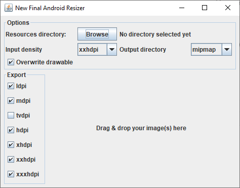

New Final Android Resizer
==============

A simple yet powerful resizer for Android developers
--------------

  
**Features**
- Resize multi folders with multi images
- Select starting density
- Select res directory, so you don't have to move the resized files
- Resize several images at once (Drag & Drop)
- Select output densities (ldpi, mdpi, tvdpi, hdpi, xhdpi, xxhdpi, xxxhdpi)
- Preserve the image format (jpg,png)
- Option to select output directory (mipmap or drawable)
- Option to select if want to overwrite file

I have not tried resizing 9patch images yet.

If you just want to download the executable jar, click <b><a href="Executable%20Jar/New-Android-Final-Resizer-1.0-SNAPSHOT.jar?raw=true">here</a></b>